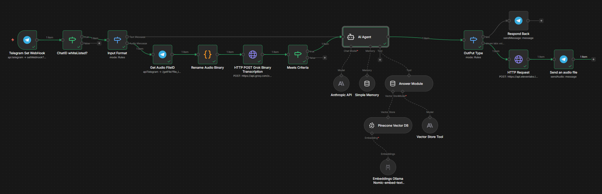

# 🤖  Telegram Travel AI Agent

A conversational agent specialized in travel, built with **n8n**, deployed locally via **Docker**, that replies in a Telegram group using **RAG** over a **Pinecone** vector database. Using Reverse Tunelling on local from ngrok
---
## 🏗️ Architecture



---


## 🛠️ Stack

| Component | Technology |
|---|---|
| Orchestration | [n8n](https://n8n.io/) (Docker) |
| LLM | Claude (Anthropic API) |
| Vector DB | Pinecone |
| Embeddings | Ollama — nomic-embed-text |
| Interface | Telegram Bot |

---

## ⚙️ Configuration

### Required credentials

- `TELEGRAM_BOT_TOKEN` — Telegram bot token
- `ANTHROPIC_API_KEY` — Anthropic API key
- `PINECONE_API_KEY` — Pinecone API key

### Security filters

The agent only responds when **both conditions** are met:

1. The `chat.id` matches the authorized group
2. The message starts with `#keyword`

---

## 🔒 Security

- Filtering by `chat.id` to prevent unauthorized use
- The bot only responds to messages prefixed with `#keyword`
- Session memory is scoped by `chat.id` (shared within the group)

---

## 💬 Usage

In the authorized Telegram group:

```
#keyword What can I visit in Tokyo?
#keyword What are the best restaurants in Rome?
```

If the information is not indexed in Pinecone, the agent replies:

> *"I don't have information about that destination or topic in my travel guides."*

---

## 🚀 Local deployment

```bash
docker compose up -d
```

Access n8n at `http://localhost:5678` and import the workflow from the JSON file in this repo.

---

## 📁 Repo structure

```
.
├── README.md
└── workflow.json       # Exported n8n workflow
```

---

## 🗺️ Roadmap

- [x] Text responses
- [ ] Image responses
- [ ] Audio responses (TTS)
- [ ] Video responses
- [ ] Server deployment

---

## 📄 License

MIT
